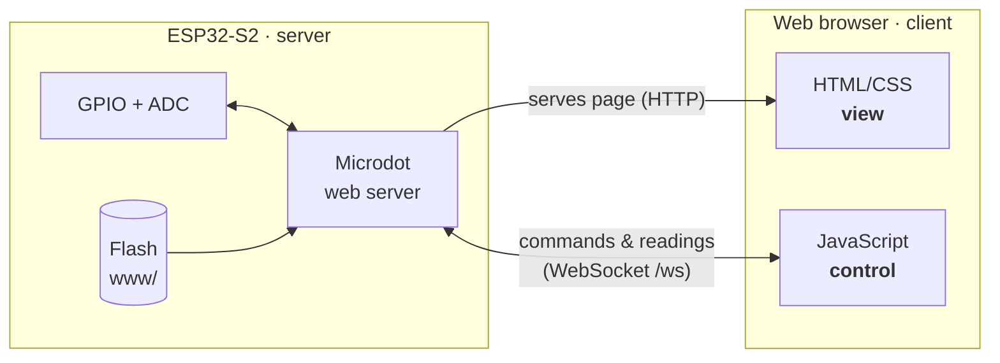
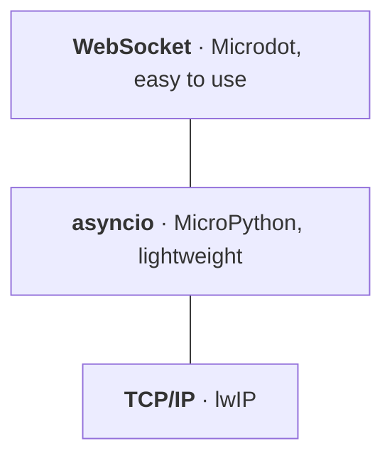
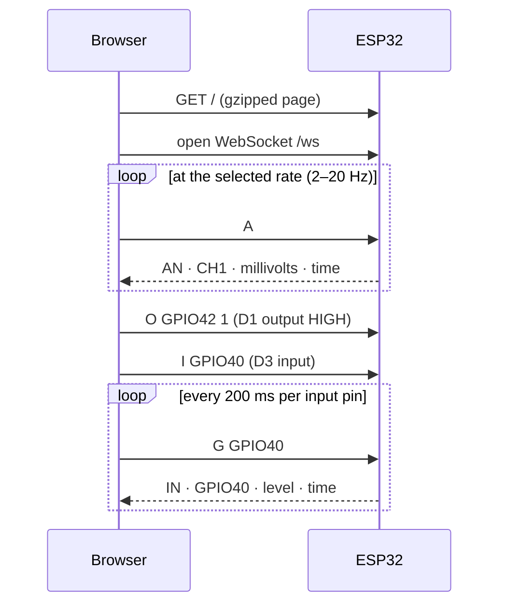

# iotoscope

A Wi-Fi oscilloscope and digital I/O tool built on the ESP32-S2. The board hosts its own web app: open it in any browser on the same network to scope signals and drive pins remotely.


## Features

- **Analog scope**: live plot of the last 10 s, 2–20 Hz sampling, min/max, pause, PNG export
- **Digital I/O**: 6 pins, each off, input (live level), or output (one-click toggle)
- **Self-contained**: the board serves the whole app, with no internet or cloud required
- **Remote-ready**: built for remote labs, automated data collection, and lab control

## Hardware

- ESP32-S2 board running [MicroPython](https://micropython.org/download/?port=esp32) 1.24+
- **Analog**: channel 1 on GPIO7 (ADC1_CH6), 0–2.5 V, calibrated
- **Digital**: D1–D6 on GPIO42, 41, 40, 39, 38, 37

Pins can be changed in `firmware/main.py` (`DIGITAL_PINS`, `ADC_PIN`) and `html/main.js` (`PINS`).

## Quick start

```sh
pip install mpremote
cp firmware/config.example.py firmware/config.py   # add your Wi-Fi SSID and password
tools/deploy.sh                                     # optionally pass the serial port
```

Then open `http://ioto.local/`, or the IP printed on the serial console (`mpremote`).

## How it works

The ESP32 serves the web app from its flash filesystem, then the browser opens a WebSocket back to the board for commands and readings.



Network stack on the board:



### Message protocol

Plain-text commands over `/ws`. Replies are fields separated by `\x04`.



| Command | Action | Reply |
| --- | --- | --- |
| `R GPIOn` | Reset pin (off) | none |
| `I GPIOn` | Set pin as input | none |
| `O GPIOn v` | Set pin as output at level `v` | none |
| `G GPIOn` | Read pin | `IN` · `GPIOn` · level · time |
| `A` | Read channel 1 | `AN` · `CH1` · mV · time |

## Project layout

- `firmware/main.py`: Wi-Fi, web server, WebSocket commands, GPIO and ADC
- `firmware/lib/microdot/`: vendored [Microdot](https://github.com/miguelgrinberg/microdot) web framework
- `html/`: the web app, with no build step and no external dependencies
- `tools/deploy.sh`: gzips the web app and copies everything to the board
